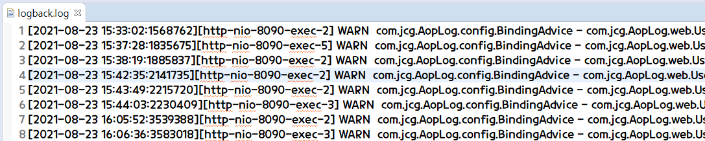
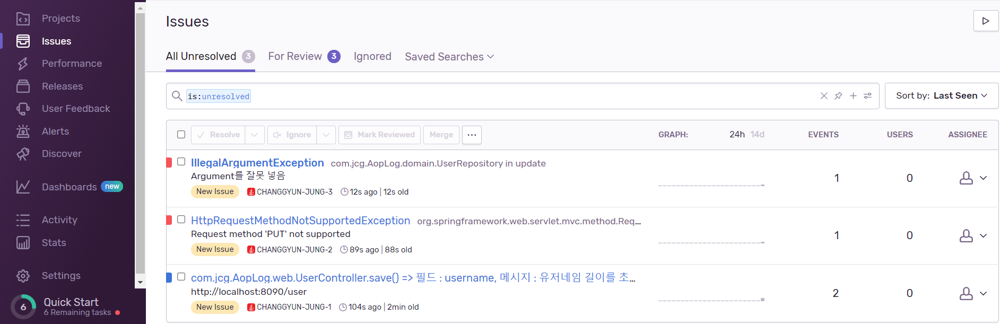

# Springboot-AOP-Log
- **Spring AOP** 구현
- **Log File, Log Tracking Using Sentry**

--------------------------------------------

## Contents
1. [Using](#using)
2. [Validation 체크와 AOP](#validation-체크와-aop)
3. [로그 파일 저장](#로그-파일-저장)
4. [Sentry](#sentry)
5. [License](#license)

--------------------------------------------

## Using
1. **Spring AOP** : Aspect Oriented Programming 관점지향프로그래밍
2. **Sentry** : Error Tracking Service

--------------------------------------------

## Validation 체크와 AOP
1. Validation 체크 방법
    1. 컨트롤러에서 if, 정규표현식 등을 사용해서 null, size 등을 검사해야 한다. -> 노가다
    2. 컨트롤러 전에 필터가 받아서 체크 : 메소드, 주소, 입력 데이터를 가지고 Reflection 한다.
2. **Validation 체크 순서**
    1. /user -> Dispatcher -> /user 주소가 있는 **함수 찾기** (어노테이션+메소드)
    2. 그 함수의 **매개변수 확인** -> **개수 확인** -> 일치하지 않으면 400 Error
    3. **일치하면 값이 들어와 있는지 확인**
3. **Dispatcher가 하는 일**
    1. 주소 Mapping
    2. IoC @Controller @RestController ...
    3. 함수 매개변수 확인해서 Request 값 비교
    4. 주입 (DI)
4. **AOP** (**Aspect Oriented Programming** 관점지향프로그래밍)
    - **핵심 기능과 공통 기능을 분리한다.**
    - **예시**
        1. 핵심 기능 : 회원가입
        2. 회원가입이 이루어지기 **전에 필요한 처리**
            1. 유효성 검사
            2. 세션 체크
            3. Log ...
        4. 위의 공통 기능들을 빼내서 (PointCut 해서) 함수의 앞 뒤 (위치는 JointPoint)에 집어 넣을 수 있다. (**중복을 제거**한다.)
5. **필터와 AOP 구분**
    - 일반적인 필터는 어디에 진입하기 직전에 돈다. (앞만 처리하고 싶을 때)
    - 필터 + 리플렉션 => 어디에 들어왔다가 빠져 나가는 것까지 처리 가능 ~= AOP (앞 뒤 처리)
6. **AOP 주요 용어**
    1. **Aspect** : 공통 기능
    2. **Advice** : Aspect의 기능 자체 (~=Aspect)
    3. **JointPoint** : Advice를 적용해야 되는 부분 (**스프링에서는 메소드만 해당**)
    4. **Pointcut** : JointPoint의 부분으로 실제로 Advice가 적용된 부분 (**JointPoint 앞, 뒤**)
    5. **Weaving** : Advice를 핵심기능에 적용하는 행위 (JointPoint에 집어넣는 행위)
7. @Around와 @Before, @After의 차이
    - @Around는 ProceedingJoinPoint 사용 (Request)이 가능하다. 
    - @Before @After 가 Request를 사용하기 위한 방법
        - **RequestContextHolder** 사용
        ```java
        HttpServletRequest request = ((ServletRequestAttributes) RequestContextHolder.currentRequestAttributes()).getRequest();
        ```
        
--------------------------------------------

## 로그 파일 저장
1. **Log Level**
    1. **ERROR** : 오류 발생
    2. **WARN** : 문제 상황 경고
    3. **INFO** : 정상적인 것, 정보를 알려주는 info
    4. **DEBUG** : 디버그 모드에서 로그 (개발하는 단계에서 주로 사용)
    5. 로그 레벨 설정을 info 로 설정할 경우 error, warn, info 만 뜬다. 로그 레벨 설정을 warn 로 설정할 경우 warn, error 만 뜬다.
2. **로그 파일 생성 과정**
    1. **Logger 사용**
    ```java
    private static final Logger log = LoggerFactory.getLogger(BindingAdvice.class);
    ```
    2. **로그 레벨별로 로그 메시지 생성**
    ```java
    if(bindingResult.hasErrors()) {
        Map<String, String> errorMap = new HashMap<String, String>();

        for(FieldError error : bindingResult.getFieldErrors()) {
            errorMap.put(error.getField(), error.getDefaultMessage());
            log.warn(type+"."+method+"() => 필드 : "+error.getField()+", 메시지 : "+error.getDefaultMessage()); 
        }
    ```
    3. src/main/resources/logback-spring.xml 생성, 설정 (**정해진 위치, 이름**)
    ```xml
    <?xml version="1.0" encoding="UTF-8"?>
    <configuration>
        <property name="LOGS_ABSOLUTE_PATH" value="./logs" />

        <appender name="STDOUT" class="ch.qos.logback.core.ConsoleAppender">
            <layout class="ch.qos.logback.classic.PatternLayout">
                <Pattern>[%d{yyyy-MM-dd HH:mm:ss}:%-3relative][%thread] %-5level %logger{36} - %msg%n</Pattern>
            </layout>
        </appender>

        <appender name="FILE" class="ch.qos.logback.core.rolling.RollingFileAppender">
            <file>${LOGS_ABSOLUTE_PATH}/logback.log</file>
            <encoder>
                <pattern>[%d{yyyy-MM-dd HH:mm:ss}:%-3relative][%thread] %-5level %logger{35} - %msg%n</pattern>
            </encoder>
            <rollingPolicy class="ch.qos.logback.core.rolling.TimeBasedRollingPolicy">
                <fileNamePattern>${LOGS_ABSOLUTE_PATH}/logback.%d{yyyy-MM-dd}.%i.log.gz</fileNamePattern>
                <timeBasedFileNamingAndTriggeringPolicy class="ch.qos.logback.core.rolling.SizeAndTimeBasedFNATP">
                    <maxFileSize>5MB</maxFileSize>
                </timeBasedFileNamingAndTriggeringPolicy>
                <maxHistory>30</maxHistory>
            </rollingPolicy>
        </appender>

        <root level="INFO">
            <appender-ref ref="STDOUT" />
        </root>

        <logger name="com.jcg.AopLog.config" level="WARN">
            <appender-ref ref="FILE" />
        </logger>

    </configuration>
    ```
    4. **애플리케이션 로그 레벨 변경 부분**
    ```xml
    <root level="INFO">
        <appender-ref ref="STDOUT" />
    </root>
    ```
3. **Capture Image**
    <p align="center">
        
    </p>

--------------------------------------------

## Sentry
1. **Sentry : 어플리케이션에서 오류가 발생하면 알려주는 에러 트래킹 서비스**
    - **파일로 저장할 경우 파일을 열어봐야 로그를 확인할 수 있는 반면 Sentry를 이용하면 Web에서 실시간으로 확인이 가능하다.**
2. Spring boot에서 Sentry 사용 [Docs](https://docs.sentry.io/platforms/java/guides/spring-boot/)
3. **설정 순서**
    1. **Dependency** 설정
        ```xml
        <dependency>
			<groupId>io.sentry</groupId>
			<artifactId>sentry-spring-boot-starter</artifactId>
			<version>5.1.1</version>
		</dependency>
        ```
    2. **application**.properties DSN 설정
        ```java
        sentry.dsn={dsn 값}
        ```
    3. **Sentry로 메세지 보내기**
        ```java
        Sentry.captureMessage(type+"."+method+"() => 필드 : "+error.getField()+", 메시지 : "+error.getDefaultMessage());
        ```
4. **Capture Image**
    <p align="center">
        
    </p>
    
--------------------------------------------

## License
- **Source Code** based on [codingspecialist](https://github.com/codingspecialist)